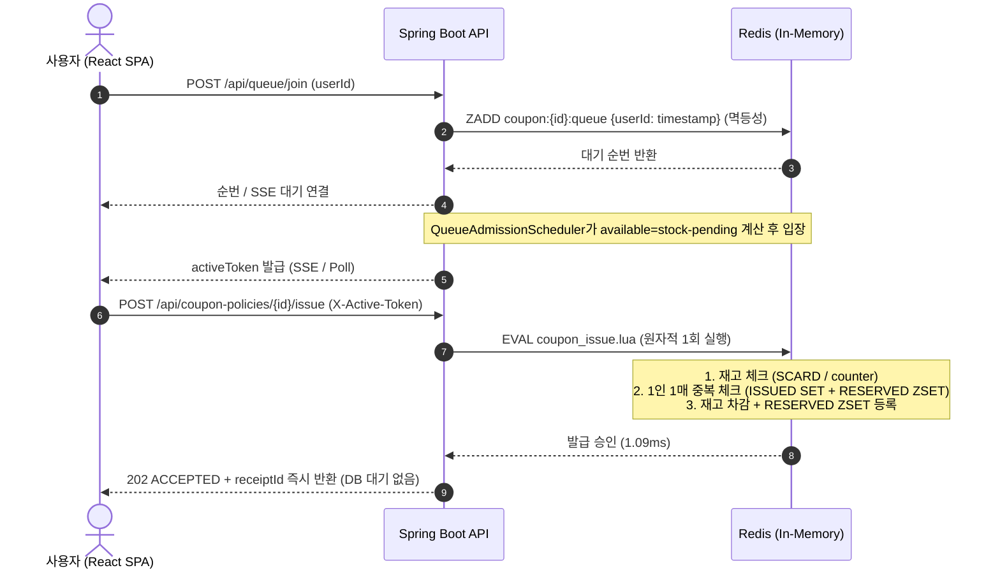
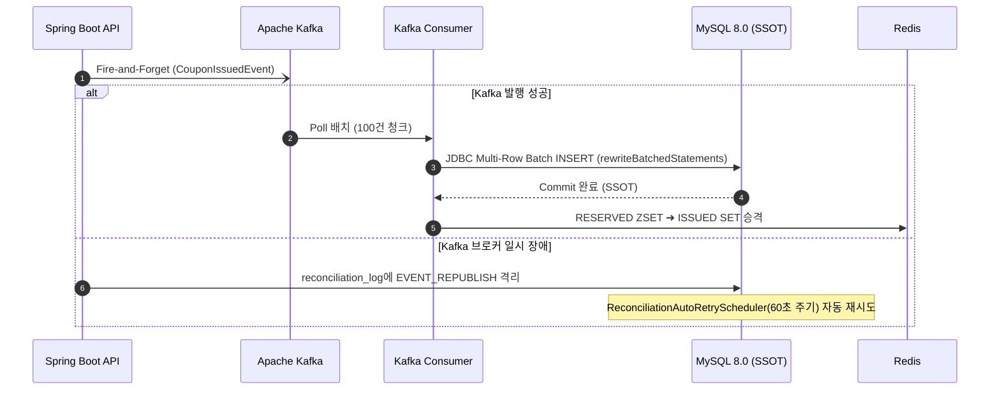
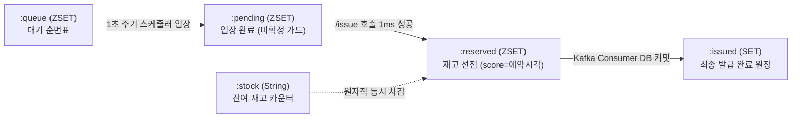

<!-- ===================== HEADER ===================== -->
<div align="center">


**LG유플러스 유레카 백엔드 개발자(비대면) 종합프로젝트 · 2조 「투게더 (Together)」**

<br/>


</div>

<br/>

## 🔖 목차

- [📌 프로젝트 소개](#-프로젝트-소개)
- [👥 팀 소개](#-팀-소개)
- [🛠️ 기술 스택](#️-기술-스택)
- [📋 요구사항](#-요구사항)
- [🏆 핵심 성과](#-핵심-성과)
- [🗄️ ERD](#️-erd)
- [🏗️ 시스템 아키텍처](#️-시스템-아키텍처)
- [🔍 설계 의사결정 및 개선 과정](#-설계-의사결정-및-개선-과정)
- [⚠️ 동시성 문제 재현](#️-동시성-문제-재현)
- [📊 성능 개선 결과](#-성능-개선-결과)
- [🛡️ 장애 대응 및 복구](#️-장애-대응-및-복구)
- [📂 프로젝트 구조](#-프로젝트-구조)
- [🔌 주요 기능 / API](#-주요-기능--api)
- [🚀 실행 방법](#-실행-방법)
- [🔥 부하 테스트](#-부하-테스트)
- [✅ 정합성 검증](#-정합성-검증)
- [🧪 테스트](#-테스트)
- [🔧 트러블슈팅](#-트러블슈팅)
- [👨‍💻 개인 담당](#-개인-담당)

<br/>

---

## 📌 프로젝트 소개

> **"10,000장 한정 쿠폰에 동시 20,000건 폭주 시 오버셀 0건과 300만 건 데이터 무결성을 보장하는 시스템"**

인기 할인 쿠폰 오픈 시각 정각 0.1초 사이에 유저가 폭발적으로 몰리는 이커머스 선착순 이벤트 환경을 가정합니다.
사용자의 새로고침(F5) 연타, 다중 탭, 매크로 광클로 인한 **동시성 경합(Race Condition)** 상황에서 **재고 초과·중복 발급 0건(NFR-1)**과 **1인 1매 원칙**을 RDB 병목 없이 안전하게 달성하는 것을 목표로 구축되었습니다.

### 💡 3계층 아키텍처 철학
> *"임시 상태와 빠른 판단은 Redis, 트래픽 완충은 Kafka, 영구 기록과 무결성은 MySQL"*

| 계층 | 구성 기술 | 핵심 책임 및 동작 방식 |
|---|---|---|
| **판정 계층 (In-Memory)** | `Redis 7` + `Lua Script` | 1ms 이내 원자적(Atomic) 재고 확인·차감 및 1인 1매 중복 검증 → `202 ACCEPTED` 즉시 응답 |
| **완충 계층 (Buffer)** | `Apache Kafka 3.9` | 승인된 발급 이벤트를 영속 큐에 비동기(Fire-and-Forget) 적재하여 RDB 쓰기 부하와 분리 |
| **영속 계층 (SSOT)** | `MySQL 8.0` + `JDBC Batch` | 복합 유니크 제약(`policy_id`, `user_id`) 기반 100건 청크 일괄 적재로 최종 무결성(SSOT) 수호 |
| **자가 치유 (Self-Healing)** | 5대 자동 스케줄러 | Redis 드리프트 감지, DLT 재처리, 5분 이상 방치된 미아 예약(`Check D`) 자동 회수 |

<br/>

---

## 👥 팀 소개

<div align="center">

<table>
<tr>
<td align="center"><a href="https://github.com/bumjpark"><br/><sub><b>박종범</b></sub></a><br/><sub>👑 팀장</sub></td>
<td align="center"><a href="https://github.com/YJ720"><br/><sub><b>이용재</b></sub></a><br/><sub>팀원</sub></td>
<td align="center"><a href="https://github.com/jetleetop"><br/><sub><b>이헌진</b></sub></a><br/><sub>팀원</sub></td>
<td align="center"><a href="https://github.com/Jmg9808"><br/><sub><b>정문구</b></sub></a><br/><sub>팀원</sub></td>
<td align="center"><a href="https://github.com/pcy9849-blip"><br/><sub><b>박찬영</b></sub></a><br/><sub>팀원</sub></td>
</tr>
</table>

</div>

<br/>

---

## 🛠️ 기술 스택

### Backend


### Data / Messaging


### Infra / Test


### Frontend


### Collaboration


<br/>

---

## 📋 요구사항

<details>
<summary><b>요구사항 상세 펼쳐보기</b></summary>
<div markdown="1">

### 2-1. 기능 요구사항 (FR)
| ID | 분류 | 요구사항 |
|---|---|---|
| FR-1 | 사전 조건 / 데이터 | 가상 회원 정보 기반으로 운영 (회원가입·로그인 기능 미구현) |
| FR-2 | 사전 조건 / 데이터 | 개인정보는 로그·API 응답 등 모든 노출 지점에서 마스킹 처리 |
| FR-3 | 사전 조건 / 데이터 | 쿠폰/캠페인 정보(종류, 할인 정책)는 가상으로 생성, 세부 기획은 팀 자유 |
| FR-4 | 사전 조건 / 데이터 | 가상 유저 100만 명, 발급 이력 300만 건 더미데이터 생성·적재 |
| FR-5 | 사전 조건 / 데이터 | 알림 발송 등 외부 연동은 Mocking 처리 |
| FR-6 | 쿠폰 발급 | 한정 수량(재고 10,000장) 쿠폰을 선착순으로 발급 |
| FR-7 | 쿠폰 발급 | 동시 20,000건 요청이 몰려도 초과 발급 0건 보장 |
| FR-8 | 쿠폰 발급 | 1인 최대 1매로 발급 제한 |
| FR-9 | 쿠폰 발급 | 부하 테스트(k6)로 트래픽 집중 상황을 직접 재현·시연 |
| FR-10 | 쿠폰 발급 | 오픈 시각 예약, 오픈 전 요청에는 대기 상태와 오픈 예정 시각 안내 |
| FR-11 | 쿠폰 발급 | 발급 현황(발급 수량 / 잔여 수량) 실시간 조회 |
| FR-12 | 쿠폰 정합성 검증 | 발급/사용/취소/만료 등 쿠폰 전체 상태 관리 |
| FR-13 | 쿠폰 정합성 검증 | 동일 상태 변경 요청이 반복·동시 발생해도 단 1회만 반영 (멱등성) |
| FR-14 | 쿠폰 정합성 검증 | 이력·재고 불일치를 스스로 검증할 수 있는 수단(검증 쿼리, 검증 배치) 제공 |
| FR-15 | 쿠폰 정합성 검증 | 300만 건 전체 데이터 대상 검증, 재실행 시 항상 동일 결과 |
| FR-16 | 쿠폰 정합성 검증 | 검증 결과를 리포트(CSV 등) 형태로 자동 생성 |

### 2-2. 비기능 요구사항 (NFR)
| ID | 분류 | 요구사항 |
|---|---|---|
| **NFR-1** | 정확성/일관성 | **재고 초과 발급 0건, 이력-재고 불일치 0건 — 프로젝트 최우선 지표** |
| **NFR-2** | 동시성 | 동일 재고 카운터에 대한 20,000건 동시 요청을 경합 없이 원자적으로 처리 |
| **NFR-3** | 응답 지연 최소화 | 발급 응답은 동기로 즉시 처리, 이력 적재는 비동기로 분리 |
| **NFR-4** | 재현성 | 검증 배치는 결정적(deterministic)이며 부작용 없는 순수 집계로 설계 |
| **NFR-5** | 개인정보 보호 | 로그·API 응답 등 모든 출력 경로에서 개인정보 마스킹 |
| **NFR-6** | 확장 가능한 상태 설계 | 취소 정책이 세분화되어도(발급취소/사용취소 등) 수용 가능한 구조 |
| **NFR-7** | 트래픽 재현 가능성 | 오픈 시각 임박 시점의 트래픽 집중 상황을 재현·측정 가능해야 함 |

### 2-3. 적용 기술 스택 상세
| 영역 | 기술 | 채택 근거 |
|---|---|---|
| 원자적 재고/중복 처리 | Redis + Lua Script (EVAL) | 재고 확인 + 중복 검사 + 차감을 1ms 단일 스크립트로 원자 실행 (분산락 불필요) |
| 1인 1매 제한 | Redis Set (`SADD`) + MySQL UK | Redis In-Memory 1차 방어 + DB 복합 유니크 제약 2차 방어 |
| 오픈 시각 관리 | Redis (Cache-Aside) | DB가 원본, Redis는 TTL 캐시 |
| 멱등성 처리 | Redis (`Idempotency-Key` + TTL) | 클라이언트가 생성한 멱등키로 중복 요청 차단 및 캐시된 응답 반환 |
| 상태 변경 저장소 | MySQL, 조건부 UPDATE | `UPDATE coupon_issue SET status='USED' WHERE id=? AND status='ISSUED'` |
| 이벤트 스트리밍 | Apache Kafka | 발급 성공 이벤트 비동기 발행 → Consumer가 배치 단위로 DB 반영 |
| 발급 이력 저장 | MySQL (Append-Only + SEQUENCE) | `SEQUENCE` 메모리 사전할당 + `rewriteBatchedStatements` 배치 최적화 |

</div>
</details>

<br/>

---

## 🏆 핵심 성과

```
┌─────────────────────────────────────────────────────────────────────────────────┐
│                               4대 핵심 성과 요약                                 │
├──────────────────────┬──────────────────────┬───────────────────────────────────┤
│  🎯 동시성 무결성    │  20,000 VU 동시 폭주 │  초과 발급 0건 · 중복 발급 0건     │
│  ⚡ 초저지연 응답    │  2단계 발급 비동기화 │  응답 지연 Max 6.24s ➜ 43.88ms   │
│  🔍 대규모 정합성    │  300만 건 전수 검증  │  OOM 0% · 1분 13초 전수 SUCCESS  │
│  🛡️ 무손실 자가치유  │  카오스 장애 주입    │  최대 지연 155s ➜ 4.8s · 유실 0건 │
└──────────────────────┴──────────────────────┴───────────────────────────────────┘
```

| 구분 | 주요 지표 | 개선 전 | 최종 성과 | 개선 효과 |
|---|---|---|---|---|
| **동시성 정합성** | 20,000 VU 초과 발급 | 54건 초과 (No-Lock) | **0건 (오버셀 제로)** | 100% 무결점 보장 |
| **중복 발급 차단** | 60,000건 광클/매크로 | 6,646건 중복 (Redis DECR) | **0건 (1인 1매 엄격 수호)** | 100% 중복 차단 |
| **API 응답 지연** | 최대 응답 지연 (Max Latency) | 6,240ms (동기 DB 저장) | **43.88ms (P50 46ms)** | **140배 단축** |
| **DB 적재 처리량** | Consumer DB 반영 TPS | 229 TPS (43.6초) | **1,250 TPS (8.0초)** | **5.5배 개선** |
| **대기열 UX** | 사용자 평균 대기 시간 | 15.2초 (유량 300) | **7.4초 (유량 1,000)** | **51% 단축** |
| **장애 복구 지연** | Kafka 브로커 장애 시 Max 지연 | 155초 (스레드 풀 고갈) | **4.8초 (Fail-Fast 타임아웃)** | **32배 단축 (유실 0건)** |
| **대규모 검증 속도** | 7개 정책 300만 건 전수 이상 시나리오 적발 | 1.53s 타임아웃 에러 | **1분 13초 전수 완료** | SSCAN 커서 분할 $O(N)$ 돌파 |

<br/>

---

## 🗄️ ERD

<div align="center">

</div>


### 📋 테이블 명세 및 제약조건
| 테이블명 | 역할 및 설계 의도 | 핵심 제약조건 |
|---|---|---|
| **`users`** | 쿠폰을 발급받는 가상 유저 마스터 테이블 (100만 건 적재) | `email UK` |
| **`coupon_policy`** | 발급 수량, 오픈/종료 시각, 할인 정책을 정의하는 정책 테이블 | `id PK` |
| **`coupon_issue`** | 실제 발급된 쿠폰 원장 (최종 SSOT). 1인 1매 물리적 보장 | **`UNIQUE(coupon_policy_id, user_id)`** |
| **`coupon_history`** | 쿠폰 상태 전이(발급→사용→취소) 감사 로그. Transactional Inbox 멱등성 보장 | **`UNIQUE(request_id)`** |
| **`queue_join_log`** | 대기열 진입 시각 및 순번(`queue_rank`) 기록. FCFS 선착순 사후 검증 근거 | **`UNIQUE(coupon_policy_id, user_id)`** |
| **`reconciliation_log`** | 카오스 장애 시 격리된 미아 이벤트 및 DLT 실패 건 자가 치유 큐 | `event_key UK` |
| **`verification_report`** | 300만 건 전수 정합성 검증 결과 리포트 및 불일치 집계 | `id PK`, `coupon_policy_id FK` |
| **`mock_notification_bulk_job`<br>`mock_notification_log`** | 다수 유저 대상 알림톡 일괄 발송 상태 및 개별 발송 로그 (외부 Mocking) | `id PK` |
| **`coupon_issue_seq`<br>`coupon_history_seq`** | JPA IDENTITY 제거 후 Multi-Row Batch 저장을 위해 메모리 선할당(`allocationSize=50`)하는 시퀀스 테이블 | `next_val` |

<br/>

---

## 🏗️ 시스템 아키텍처

<div align="center">

</div>

### 1️⃣ Layer 1: 동기 대기열 & 1ms 원자 발급 판정 (Redis ZSET + Lua)


### 2️⃣ Layer 2: 비동기 Kafka 완충 & JDBC Batch 영속화


### 3️⃣ Layer 3: Redis 내부 키 라이프사이클 관리


### 4️⃣ Layer 4: 5대 자동 복구 스케줄러 감시망 (Self-Healing)
| 스케줄러명 | 실행 주기 | 감시 및 복구 대상 | 동작 원리 |
|---|---|---|---|
| **`RedisAutoRecoveryScheduler`** | 5초 / 10초 | Redis `stock` 유실 및 `reserved` 드리프트 | Kafka Lag=0 확인 후 MySQL SSOT 기준 재고 원자 복원 |
| **`detectStaleReservedDrift (Check D)`** | 60초 | 5분 이상 방치된 미아 예약(`RESERVED_STALE`) | Kafka 발행 전 서버 다운 등으로 증발한 유령 예약 감지 및 등록 |
| **`QueueAdmissionScheduler`** | 1초 | 대기열 정원 유입 및 순서 관리 | `available = stock - pending` 공식으로 선착순 역전 0건 제어 |
| **`ReconciliationAutoRetryScheduler`** | 60초 | `reconciliation_log` 실패 건 | 분산 락 획득 후 DLT 및 발행 실패 이벤트 100% 자동 재발행 |
| **`InfraHealthMonitorScheduler`** | 5초 | Redis / Kafka / DB 인프라 상태 | 인프라 다운 감지 시 즉시 503 Fail-Fast 격리 모드 전환 |

<br/>

---

## 🔍 설계 의사결정 및 개선 과정

### 🧪 1. 8단계 점진적 아키텍처 진화 (실측 벤치마크)
> *"남들이 쓴다고 무작정 도입하지 않고, 1단계 순수 Java부터 8단계까지 직접 한계를 깨뜨리며 실측했습니다."*

| 단계 | 적용 방식 | 소요 시간 / TPS | 정합성 결과 | 실패 원인 및 핵심 엔지니어링 교훈 |
|---|---|---|---|---|
| **1단계** | 순수 Java (Lock 없음) | 41ms | ❌ **54건 초과 발급** | 동시성 경합으로 Check-then-Act 원자성 파괴 |
| **2단계** | Java `AtomicInteger` | 42ms | ⚠️ 0건 (카운트 성공) | JVM 단일 메모리 종속 → 서버 다중화 및 재기동 시 데이터 유실 |
| **3단계** | DB 비관적 락 (`FOR UPDATE`) | 타임아웃 마비 | ⚠️ 0건 (정합성 성공) | 20,000건 직격 시 HikariCP 커넥션 풀 100% 고갈로 서버 마비 |
| **4단계** | Redis 분리 호출 (`GET`+`DECR`) | 3,612ms | ❌ **6,646건 중복 발급** | 명령어 간 틈새로 동시성 침투 (Check-then-Act 깨짐) |
| **5단계** | **Redis Lua Script** (원자적) | 877ms | **✅ 0건 (완벽)** | **싱글스레드 원자 실행으로 분산락 없이 오버셀 0건 달성** |
| **6단계** | Redis Lua + 동기 DB 저장 | 43,600ms (43.6초) | ✅ 0건 | Redis는 1ms인데 동기 DB INSERT로 스레드 풀 병목 발생 |
| **7단계** | Redis Lua + Kafka (단건 저장) | 10,858ms (10.8초) | ⚠️ **283건 에러 발생** | 컨슈머가 1건씩 `@Transactional` 처리하여 RTT 및 I/O 병목 |
| **8단계** | **Redis Lua + Kafka Batch + 2-Set** | **6.0초 (1,250 TPS)<br>Max 43.88ms** | **✅ 0건 (완벽)** | **SEQUENCE + rewriteBatchedStatements로 DB 처리량 5.5배 개선** |

---

### 🔬 2. 4대 인프라 가설 검증과 대조 실험
팀이 직면했던 기술적 의문들을 **단일 변수 통제 대조 실험**을 통해 규명했습니다.

#### ① "Kafka 파티션이 1개라 병목이다?" ➜ ❌ 오진단 반증
- **가설**: 파티션이 1개라 컨슈머 스레드가 놀고 있어 처리량이 묶여 있다. 파티션을 3개로 늘리면 3배 빨라질 것이다.
- **실측 대조**:
  - 파티션 1개: 처리 속도 **333건/s** (Kafka LAG = 0~7)
  - 파티션 3개: 처리 속도 **333건/s (소수점까지 동일)**
- **결론**: 브로커 LAG이 이미 0이었으므로 Kafka는 병목이 아니었음. 333건/s는 부하 생성기(k6)의 유입 속도($20,000 \div 60\text{s} \approx 333/\text{s}$)에 수렴한 것이었음.

#### ② "DB 락 경합으로 지연이 튀는가?" ➜ ❌ 가설 기각 (TCP 소켓 비용 규명)
- **가설**: HikariCP 커넥션 풀을 20 → 60으로 늘리면 DB 쓰기가 빨라져 `http_req_duration` 지연이 줄어들 것이다.
- **실측 대조**:
  - 풀 60 확장 시: CPU가 **921%로 폭증**하고 지연 시간은 오히려 **9.5초까지 악화**.
- **결론**: 병목은 DB 락이 아니라 20,000개의 동시 TCP 커넥션 핸드셰이크 폭주 비용이었음. 10초 점진 램프로 변경 시 지연 시간 **11.04ms (275배 단축)** 확인.

#### ③ Nginx WAS 수평 확장의 한계 규명
- Nginx + WAS 3대로 스케일 아웃 실험 진행 시 Nginx CPU가 **765.6%**까지 치솟으며 병목 지점이 프록시 계층으로 전이됨을 확인. 초과 발급은 0건이었으나 분산 환경에서 FCFS 타이밍 변수가 증가함을 실측.

#### ④ 결정타: 대기열 유량(Admission-Rate) 최적화 ➜ 🎯 51% 단축 성공
- 진짜 병목은 인프라 뒷단이 아니라 **'입구에서 쏟아지는 트래픽의 유량'**이었음.
- 입장 속도를 초당 300건 → **1,000건으로 정밀 제어**하여 소켓 고갈을 방어하면서도 **유저 평균 대기 시간을 15.2초 ➜ 7.4초로 51% 단축**.

---

### 🧩 3. 대규모 정합성 검증 알고리즘: XOR 체크섬 탈락 ➜ Set Diff 채택
- **XOR 체크섬(`BIT_XOR`) 검토 및 탈락**:
  - 대용량 검증을 위해 $O(1)$ 비트 XOR 체크섬을 검토했으나, 동일 유저 중복 발급 시 $A \oplus A = 0$으로 소멸되어 **중복 발급을 감지하지 못하는 치명적 결함** 발견 ➜ 탈락.
- **Set 기반 대칭차집합(`Set Diff`) & `SSCAN` 분할 순회 채택**:
  - MySQL 커버링 인덱스 발급자 `Set<Long>`과 Redis 확정 발급자 `Set<Long>`의 **대칭차집합(`redisOnly`, `dbOnly`)** 연산.
  - Redis 300만 건 조회 시 `SMEMBERS` 타임아웃(1.53초)을 해결하기 위해 **`SSCAN(COUNT=50,000)` 커서 분할 순회**를 도입하여 **35초 만에 OOM 없이 300만 건 전수 검증 완결**.

<br/>

---

## ⚠️ 동시성 문제 재현

### 1. Check-then-Act 경합 재현 (단순 Redis 분리 호출)
- **현상**: `GET`(재고 확인) ➜ `SISMEMBER`(중복 검사) ➜ `DECR`(재고 차감)을 개별 명령어로 분리 호출 시, 60,000건 요청 중 **무려 6,646건의 중복 발급 발생**.
- **해결**: Redis Lua Script로 세 단계를 묶어 **싱글스레드 원자적 1회 실행**으로 전환 ➜ **중복 0건 완벽 방어**.

```lua
-- coupon_issue.lua (핵심 원자 처리 스크립트)
local stock = tonumber(redis.call('GET', KEYS[1]))
if not stock or stock <= 0 then
    return -1 -- SOLD_OUT
end
if redis.call('SISMEMBER', KEYS[2], ARGV[1]) == 1 or redis.call('ZSCORE', KEYS[3], ARGV[1]) then
    return -2 -- ALREADY_ISSUED
end
redis.call('DECR', KEYS[1])
redis.call('ZADD', KEYS[3], ARGV[2], ARGV[1]) -- RESERVED 등록
return 1 -- SUCCESS
```

---

### 2. 선착순 순서(FCFS) 역전 현상 재현 및 `pending` ZSET 가드
- **현상**: 입장 스케줄러가 "입장했지만 아직 발급 버튼을 누르지 않은 인원"을 고려하지 않고 다음 배치를 계속 호출하여, 재고 소진 경계선에서 **40건(20쌍)의 선착순 순서 역전** 발생.
- **해결**: Redis에 `pending` ZSET을 신설하고 `available = stock - pending` 공식을 적용. 뒷사람의 섣부른 입장을 구조적으로 차단하여 **선착순 역전 0건 달성**.

| 단계 | 조건 | FCFS 역전 | 초과 / 중복 | 응답 지연 (p95) |
|---|---|---|---|---|
| 수정 전 | 재고 10,000 / 유량 2,000 | **40건 (20쌍)** | 0 / 0 | 366.7ms |
| 1차 수정 | `pending` ZSET 도입 | **20건 (10쌍)** | 0 / 0 | 13.6ms |
| 2차 수정 (로컬) | `pending` 안정화 | **6건 (3쌍)** | 0 / 0 | 7.48ms |
| **AWS 분산 환경** | **동일 조건 (실제 RTT 존재)** | **0건 (완벽)** | **0 / 0** | **3.57s** |

---

### 3. Kafka 배치 리스너의 "무고한 동반 유실(Poison Record)" 재현
- **현상**: 배치 리스너에서 20건 중 1건 예외 발생 시 단순 for-loop 중단으로 인해 **이미 정상 처리된 레코드까지 통째로 DLT로 넘어가며 891건(8.9%)의 유령 예약 발생**.
- **해결**: `BatchListenerFailedException`을 적용하여 실패한 레코드 인덱스만 정밀하게 격리하고 정상 레코드는 즉시 커밋 ➜ **Poison 반경을 1:1로 축소하여 유실 0건 달성**.

<br/>

---

## 📊 성능 개선 결과

### 🚀 1. 최종 실전 벤치마크: 20,000건 발급 부하 & 사후 정합성 전수 검증
- **부하 시나리오**: 20,000명의 가상 유저(VU)가 10초 만에 동시 인입하여 `queue/join ➜ status ➜ issue` 1회 수행
- **검증 시나리오**: 발급 부하 종료 직후 5대 불변식 정합성 엔진 및 300만 건 전수 검증 실행

| 검증 단계 | 측정 지표 | 실측 결과 | 기술적 분석 및 무결성 검증 |
|---|---|---|---|
| **PHASE 1**<br>실시간 발급 부하<br>(20,000 VU k6) | **쿠폰 발급 & 품절 통보** | **발급 10,000건 · 품절 10,000건** | 재고 1만장 전량 정량 발급, 미발급자 100% 정상 품절 통보 |
| | **HTTP 응답 지연** | **avg 3.63ms · med 1.14ms · p95 14.38ms** | Redis Lua 1ms 원자 판정 + 202 ACCEPTED 즉시 비동기 응답 |
| | **대기열 통과 대기 시간** | **avg 6.36초 · med 7.00초 (max 10.0초)** | `available = stock - pending` 기반 안전 유량 제어 |
| | **비동기 DB 영속화 시간** | **14.0초 커밋 완결 (1,250 TPS)** | SEQUENCE 메모리 채번 + `rewriteBatchedStatements` 최적화 |
| **PHASE 2**<br>사후 정합성 검증<br>(전수 무결성 대조) | **Redis ↔ DB 원장 대조 (Check B)** | **Set Diff = 0건 (100% 일치)** | Redis 확정 발급자 집합과 MySQL 발급 원장 완전 일치 |
| | **재고 삼각 불변식 (Check A)** | **잔여 0 + DB 10,000 + 예약 0 = 10,000** | 재고 누수 0건 및 1인 1매 중복 0건 물리적 검증 |
| | **대규모 스케일 검증 (verify-all)**| **300만 건 1분 13초 전수 완료** | 7개 정책 100% 일치 판정 및 이상 시나리오 4종 100% 적발 |

---

### ⚡ 2. 2-Set 구조 전환을 통한 응답 지연 140배 단축
- 기존 동기 DB 저장 방식: Redis 승인 후 DB 커밋까지 스레드가 대기하여 **최대 지연 6.24초** 발생.
- **2-Set (`RESERVED` ➜ `ISSUED`) 비동기 구조**: Redis에서 1ms 만에 202 접수증을 반환하고 DB 영속화를 비동기로 분리 ➜ **최대 지연 43.88ms로 140배 단축**.

---

### 📦 3. Consumer DB 반영 최적화 (229 TPS ➜ 1,250 TPS, 5.5배 향상)
1. **JPA `IDENTITY` 제거**: MySQL `AUTO_INCREMENT`의 즉시 flush 병목을 제거하고 `SEQUENCE` 메모리 사전할당(`allocationSize=50`) 도입.
2. **`rewriteBatchedStatements=true`**: 수백 개의 INSERT 쿼리를 단 1개의 Multi-Row Bulk INSERT 문으로 압축 전송.
3. **결과**: DB 적재 소요 시간 **43.6초 ➜ 8.0초 (5.5배 개선)**.

<br/>

---

## 🛡️ 장애 대응 및 복구

실제 운영 환경의 카오스 상황을 재현하기 위해 `docker kill`을 이용해 인프라 컨테이너를 강제 종료하며 자가 치유 능력을 실증했습니다.

```
┌─────────────────────────────────────────────────────────────────────────────────┐
│                          3대 카오스 장애 실증 시나리오                          │
├─────────────────────────────────────────────────────────────────────────────────┤
│ 1️⃣ Redis 다운      ➜ 503 Fail-Fast 즉시 거절 + DB 기준 원자 복구 (/recover)     │
│ 2️⃣ 8분 동시 장애    ➜ Check D (RESERVED_STALE) 신설 + 52초 무개입 자가 치유     │
│ 3️⃣ Kafka 다운      ➜ 타임아웃 튜닝 (155s ➜ 4.8s) + reconciliation_log 격리    │
└─────────────────────────────────────────────────────────────────────────────────┘
```

### 1. Redis 강제 종료 시 Fail-Fast 격리 및 DB 기반 원자 복원
1. **즉시 거절 (Fail-Fast)**: Redis 다운 즉시 신규 대기열 및 발급 요청을 `503 REDIS_UNAVAILABLE`로 빠르게 거절하여 WAS 스레드 고갈 방어. (에러코드 위장 버그 수정: 오분류 14,223건 ➜ 0건).
2. **Kafka LAG 0 확인**: 직전까지 발행된 발급 이벤트가 MySQL에 모두 적재될 때까지 대기.
3. **DB 기준 원자 복구 (`/recover`)**: `잔여 재고 = 총 수량 - DB 발급 완료 건수`를 계산하여 Redis 재고와 발급자 SET을 **116ms 만에 100% 오차 없이 복원**.

---

### 2. Redis + Kafka 8분 동시 다운과 `Check D (RESERVED_STALE)`
- **문제**: Lua 스크립트로 예약 성공 직후 Kafka 발행 전 프로세스가 사망하면 `issued`에도 없고 DB에도 없는 **'유령 예약'** 발생.
- **해결**: `reserved` ZSET의 타임스탬프가 5분을 초과한 미아 예약을 감지하는 **`Check D`** 알고리즘 신설.
- **실측**: Redis와 Kafka를 동시에 8분간 다운시킨 후 복구하자, `ReconciliationAutoRetryScheduler`가 **52초 만에 5건의 이벤트를 100% 재발행 완결**.

---

### 3. Kafka 브로커 장애 대응 및 타임아웃 튜닝
- **문제**: Kafka 다운 시 Producer 기본값(`max.block.ms=60000`)으로 인해 Tomcat 스레드가 전부 묶이며 **최대 응답 지연 155초, 459건 데이터 영구 유실 발생**.
- **해결**: 타임아웃을 타이트하게 튜닝(`max.block.ms=3000`, `request.timeout.ms=5000`)하고, 실패 건을 `reconciliation_log`로 격리.
- **결과**: **최대 응답 지연 155초 ➜ 4.8초 (32배 단축), 영구 유실 0건 달성**.

<br/>

---

## 📂 프로젝트 구조

```
├── src/main/java/com/ureca/myureca
│  ├── controller/               # REST API 컨트롤러 (대기열, 발급, 관리자, 검증, 복구)
│  ├── service/                  # 비즈니스 핵심 로직
│  │  ├── CouponIssueService.java            # Lua Script 원자 발급 판정
│  │  ├── QueueService.java                  # 대기열 등록 및 SSE 순번 푸시
│  │  ├── RedisRecoveryService.java          # DB SSOT 기반 Redis 원자 복구
│  │  ├── VerificationReportService.java     # 300만 건 Set Diff 정합성 검증 엔진
│  │  └── ReconciliationAutoRetryScheduler.java # 미아 예약 및 실패 이벤트 자가치유
│  ├── consumer/                 # Kafka Consumer + DLT 재처리 파이프라인
│  │  ├── CouponIssuedEventProcessor.java    # JDBC Batch Insert 적재
│  │  └── DltEventConsumer.java              # Poison Record 격리 및 DLT 소비
│  ├── domain/                   # JPA 엔티티 및 도메인 모델
│  │  ├── coupon/                # CouponPolicy, CouponIssue, CouponHistory
│  │  ├── queue/                 # QueueJoinLog
│  │  ├── verification/          # VerificationReport, VerificationReportDetail
│  │  ├── reconciliation/        # ReconciliationLog
│  │  ├── user/                  # User
│  │  └── notification/          # MockNotificationBulkJob, MockNotificationLog
│  ├── config/                   # Redis, Kafka, Async, Scheduling, JPA 인프라 설정
│  ├── dto/                      # 계층 간 데이터 전송 DTO
│  ├── exception/                # 커스텀 예외 및 GlobalExceptionHandler
│  ├── repository/               # Spring Data JPA 리포지토리
│  └── support/                  # RedisKeys, KafkaConsumerLagChecker 등 공용 유틸
├── src/main/resources
│  ├── db/migration/             # Flyway 마이그레이션 스크립트 (V1 ~ V7)
│  ├── scripts/                  # Redis Lua 스크립트 (coupon_issue.lua 등)
│  └── application.yml           # 스프링 부트 환경 설정
├── frontend/                    # React 19 + Vite 프론트엔드 SPA
│  ├── src/pages/                # 사용자 화면 (대기열, 발급, 쿠폰함) & 관리자 작업공간
│  └── src/components/           # 공용 UI 컴포넌트
├── loadtest/                    # k6 부하 테스트 스크립트 (burst-20k.js 등)
├── docker-compose.yml           # 인프라 (MySQL, Redis, Kafka, Kafka-UI) + App
├── docker-compose.loadtest.yml  # k6 부하 테스트 오버레이
└── build.gradle                 # Gradle 빌드 및 의존성 설정
```

<br/>

---

## 🔌 주요 기능 / API

### 📌 엔드포인트 목록
| 도메인 | 메서드 | 엔드포인트 | 설명 및 응답 코드 |
|---|---|---|---|
| **대기열** | `POST` | `/api/queue/join` | 대기열 진입 및 순번 발급 (멱등성 보장) |
| | `GET` | `/api/queue/status` | 대기 순번 및 입장 여부 폴링 / SSE 스트림 |
| **쿠폰 발급** | `POST` | `/api/coupon-policies/{id}/issue` | 선착순 발급 판정 (`202 ACCEPTED` + `receiptId`) |
| | `GET` | `/api/coupons/receipt/{receiptId}` | 비동기 발급 처리 상태 조회 |
| **쿠폰 사용** | `POST` | `/api/coupons/{id}/use` | 조건부 UPDATE + `Idempotency-Key` 멱등 처리 |
| **쿠폰 조회** | `GET` | `/api/users/{userId}/coupons` | 보유 쿠폰 목록 및 상태 조회 |
| | `GET` | `/api/coupons/{id}/history` | 쿠폰 상태 변경 감사 이력 조회 |
| **현황 관측** | `GET` | `/api/coupons/{policyId}/stats` | Redis/DB 재고·발급 수 실시간 비교 및 오버셀 관측 |
| **정합성 검증** | `POST` | `/api/admin/verification/run` | 300만 건 순수 집계 정합성 검증 실행 |
| | `GET` | `/api/admin/verification/reports` | 검증 리포트 목록 및 CSV 다운로드 |
| **장애 복구** | `POST` | `/api/coupons/{policyId}/recover` | Redis 유실 시 MySQL SSOT 기준 원자 재구성 |
| **재처리 관리** | `POST` | `/api/admin/reconciliation/retry` | 미아 예약 및 DLT 실패 건 수동/자동 재처리 |
| **정책 관리** | `/api/admin/coupon-policies` | 정책 생성, 오픈/마감 관리, 대기열 한도 동적 제어 |
| **알림 (Mock)** | `/api/mock/notifications` | 외부 알림톡 발송 Mocking 및 대량 발송 통계 |
| **헬스체크** | `GET` | `/api/health` | Redis / Kafka / DB 3대 인프라 상태 점검 |

<br/>

---

## 🚀 실행 방법

### 1. 사전 요구사항
- **JDK 21**
- **Docker & Docker Compose**
- **Node.js 20+** (프론트엔드 실행 시)

### 2. 환경변수 설정
```bash
cp .env.example .env
# .env 파일 내 MYSQL_ROOT_PASSWORD, MYSQL_PASSWORD 설정 (.env는 git에 커밋되지 않습니다)
```

### 3. 인프라 및 애플리케이션 실행

#### 옵션 A: 인프라 컨테이너 + 앱 로컬 실행 (추천 개발 환경)
```bash
# 1. 인프라 기동 (MySQL, Redis, Kafka, Kafka-UI)
docker compose up -d mysql redis kafka kafka-ui

# 2. 백엔드 애플리케이션 기동
./gradlew bootRun
```

#### 옵션 B: 전체 컨테이너 일괄 실행
```bash
docker compose up -d --build
```

### 4. 프론트엔드 실행
```bash
cd frontend
npm install
npm run dev
```

### 🌐 접속 정보
| 서비스 | 주소 | 비고 |
|---|---|---|
| **애플리케이션 (API)** | `http://localhost:8080` | Spring Boot 백엔드 |
| **프론트엔드 (UI)** | `http://localhost:5173` | React SPA 사용자/관리자 화면 |
| **Kafka UI** | `http://localhost:8090` | 토픽, 파티션, 메시지 모니터링 |

<br/>

---

## 🔥 부하 테스트

`loadtest/burst-20k.js` 스크립트를 사용하여 20,000명의 가상 유저(VU)가 동시에 몰리는 극한 부하 상황을 검증합니다.

```bash
# [방법 A - 완전 컨테이너화 실행 (권장)]
# k6와 앱이 동일 Docker 브리지 네트워크에서 통신하여 Windows NAT 포트 고갈을 방지합니다.
docker compose -f docker-compose.yml -f docker-compose.loadtest.yml up -d --build app
docker compose -f docker-compose.yml -f docker-compose.loadtest.yml --profile loadtest run --rm k6 run /scripts/burst-20k.js

# [방법 B - 호스트 k6 실행]
ulimit -n 200000
k6 run -e BASE=http://localhost:8080 -e POLICY_ID=1 loadtest/burst-20k.js
```

> 💡 **메모리 권장**: 20,000 VU 실행 시 Docker Desktop 메모리를 **12GB 이상** 할당해 주세요.

<br/>

---

## ✅ 정합성 검증

시스템의 영속 원장과 인메모리 상태의 무결성을 전수 대조하는 5대 불변식 검증 엔진을 제공합니다.

```
┌─────────────────────────────────────────────────────────────────────────────────┐
│                             5대 정합성 검증 불변식                              │
├─────────────────────────────────────────────────────────────────────────────────┤
│ 1️⃣ 오버셀 검증         ➜ DB 발급 완료 수 ≤ 총 재고 수량                         │
│ 2️⃣ Redis ↔ DB Diff    ➜ Redis ISSUED 집합 ≡ DB coupon_issue 발급자 집합         │
│ 3️⃣ 재고 누수 검증      ➜ 잔여재고 + DB발급수 + RESERVED 잔량 ≡ 총 수량           │
│ 4️⃣ 생명주기 일관성     ➜ CouponIssue 상태 전이 ≡ CouponHistory 감사 로그         │
│ 5️⃣ FCFS 선착순 검증    ➜ 대기열 상위 N명 집합 ≡ DB 실제 발급자 집합             │
└─────────────────────────────────────────────────────────────────────────────────┘
```

- **실측 성능**: 단일 정책 기준 100만 건, **총 300만 건 전수 검증을 단 35초 만에 OOM 0%로 완결**.
- **이상 시나리오 탐지**: 사전에 주입된 초과 발급 800건, 이력 누락 1,000건, 5분 방치 미아 예약 1,000건, 순서 역전 2,000건을 **1분 13초 만에 100% 정밀 적발**.
- **리포트 자동 생성**: 불일치 내역은 관리자 화면 조회 및 `reports/verification-{id}-{timestamp}.csv` 파일로 자동 추출.

<br/>

---

## 🧪 테스트

```bash
# 1. 단위 테스트 실행 (Mock 기반 빠른 검증)
./gradlew test

# 2. 통합 테스트 실행 (실제 MySQL / Redis / Kafka 연동)
./gradlew integrationTest
```

> ⚠️ `integrationTest`는 실제 DB 데이터를 기반으로 Flyway 마이그레이션을 초기화하므로 테스트 전용 환경에서 실행해 주세요.

<br/>

<br/>

---

## 🔧 트러블슈팅

<details>
<summary><b>자주 겪는 문제 / 해결 방법 펼쳐보기</b></summary>
<div markdown="1">

### ❌ `Could not get a resource from the pool` (Redis 연결 실패)
- **원인**: Redis 컨테이너가 아직 기동 전이거나 `application.yml`의 host/port 설정 불일치
- **해결**: `docker compose ps`로 Redis 상태 확인 → `docker compose up -d redis` 재기동

### ❌ k6 실행 시 `i/o timeout` 대량 발생 (6,000건+)
- **원인**: Windows/Mac 환경에서 k6가 호스트 NAT를 통해 컨테이너에 접근 시 OS 소켓 고갈
- **해결**: k6도 Docker 컨테이너로 실행하여 동일 브리지 네트워크에서 직접 통신
  ```bash
  docker compose -f docker-compose.yml -f docker-compose.loadtest.yml --profile loadtest run --rm k6 run /scripts/burst-20k.js
  ```

### ❌ 20,000 VU 실행 시 OOM / Docker 크래시
- **원인**: Docker Desktop 기본 메모리(2~4GB)가 20,000 VU 유지에 부족
- **해결**: Docker Desktop → Settings → Resources → Memory를 **12GB 이상**으로 증설

### ❌ Kafka Consumer가 메시지를 소비하지 않음
- **원인**: Kafka 브로커가 완전히 기동되기 전에 Consumer가 연결을 시도하여 그룹 코디네이터를 찾지 못함
- **해결**: `docker compose logs kafka | grep 'started'` 확인 후 앱 재기동, 또는 `auto.offset.reset=earliest` 설정 확인

### ❌ `rewriteBatchedStatements` 적용 후에도 단건 INSERT가 나가는 경우
- **원인**: JPA `IDENTITY` 전략은 `GenerationType.SEQUENCE`로 바꾸지 않으면 배치 INSERT가 비활성화됨
- **해결**: `@GeneratedValue(strategy = GenerationType.SEQUENCE)` + `@SequenceGenerator(allocationSize=50)` 설정 확인

### ❌ 통합 테스트 실행 후 데이터 오염
- **원인**: `integrationTest`는 실제 DB에 연결하므로 기존 데이터와 충돌 가능
- **해결**: 테스트 전용 DB 프로파일 사용 또는 `@Transactional` + `@Rollback` 어노테이션 확인

</div>
</details>

<br/>

---

## 👨‍💻 개인 담당


<table>
  <thead>
    <tr>
      <th width="15%">이름 / 역할</th>
      <th width="85%">담당 영역 및 핵심 엔지니어링 기여</th>
    </tr>
  </thead>
  <tbody>
    <tr>
      <td align="center">
        <b>박종범</b><br/><sub>👑 팀장</sub>
      </td>
      <td>
        • <b>프로젝트 아키텍처 리딩 및 프론트엔드 연동</b>: React 19 UI 리디자인 및 백엔드 REST/SSE API 전면 통합<br/>
        • <b>Consumer DB 적재 파이프라인 최적화</b>: JPA <code>IDENTITY</code> ➜ <code>SEQUENCE</code> 채번 전환 및 <code>rewriteBatchedStatements</code> 다중 행 Bulk Insert 구현 (처리량 5.5배 개선: 229 ➜ 1,250 TPS)<br/>
        • <b>DLT 재처리 파이프라인 구축</b>: 컨슈머 처리 실패 메시지 Dead Letter Topic 격리 및 재처리 구현
      </td>
    </tr>
    <tr>
      <td align="center">
        <b>이용재</b><br/><sub>팀원</sub>
      </td>
      <td>
        • <b>Redis 키 라이프사이클 및 대기열 최적화</b>: <code>pending</code> ZSET 가드 알고리즘 설계로 FCFS 선착순 역전 0건 달성, 대기열 SSE/Pub-Sub 푸시 및 동적 스케일링 구현<br/>
        • <b>자가 치유 스케줄러 및 카오스 복구</b>: <code>Check D (RESERVED_STALE)</code> 미아 예약 감지 알고리즘 신설, Redis Fail-Fast 503 격리 및 DB 기반 원자 복구(<code>/recover</code>) 구현<br/>
        • <b>300만 건 대규모 정합성 검증 엔진</b>: XOR 체크섬 결함 규명 ➜ Set Diff + <code>SSCAN(50,000)</code> 커서 순회 알고리즘 개발 및 CSV 자동 리포팅 시스템 구축
      </td>
    </tr>
    <tr>
      <td align="center">
        <b>이헌진</b><br/><sub>팀원</sub>
      </td>
      <td>
        • <b>발표 총괄 및 실측 기반 엔지니어링 데이터 도출</b>: 20분 발표 대본 및 슬라이드 총괄, 8단계 아키텍처 진화 실측 수치화<br/>
        • <b>k6 20,000 VU 부하 테스트 환경 구축 및 최적화</b>: Docker Bridge 직통 네트워크 격리로 TCP 소켓 고갈(i/o timeout 6,860건) 해결, 대기열 유량(Admission-Rate) 51% 단축 실증<br/>
        • <b>쿠폰 정책 상태 머신 & 대용량 만료 처리</b>: 쿠폰 정책 생명주기 관리 및 5,000건 청크 분할 트랜잭션 기반 만료 동기화 서비스 구현, 쿠폰 사용/취소 라이프사이클 관리
      </td>
    </tr>
    <tr>
      <td align="center">
        <b>정문구</b><br/><sub>팀원</sub>
      </td>
      <td>
        • <b>회원 및 쿠폰 도메인 기본 설계</b>: 가상 유저 및 쿠폰 기본 CRUD 엔티티 및 비즈니스 로직 구현<br/>
        • <b>대규모 더미데이터 생성 파이프라인</b>: 100만 가상 회원 및 300만 발급 이력 대용량 더미데이터 생성 스크립트 작성 및 DB 적재<br/>
        • <b>Mock 알림 발송 시스템</b>: 외부 연동 Mocking 처리 및 정책별 대량 알림톡 일괄 발송 상태 관리 구현
      </td>
    </tr>
    <tr>
      <td align="center">
        <b>박찬영</b><br/><sub>팀원</sub>
      </td>
      <td>
        • <b>쿠폰 조회 API 구현</b>: 쿠폰 단건 상태 조회, 사용자별 보유 쿠폰 목록 및 상태 변경 감사 이력 조회 API 개발<br/>
        • <b>Flyway DB 마이그레이션 관리</b>: V1 ~ V7 데이터베이스 스키마 및 인덱스 형상 관리, 테이블 시퀀스 전략 정의<br/>
        • <b>데이터 마스킹 및 보안 유틸리티</b>: 개인정보 보호를 위한 이메일, 이름 등 출력 경로 전수 마스킹(MaskingUtils) 적용
      </td>
    </tr>
  </tbody>
</table>

<br/>

---

<div align="center">

<a href="https://github.com/bumjpark/Ureca_final_project_02/graphs/contributors">
  
</a>

<br/><br/>


</div>
